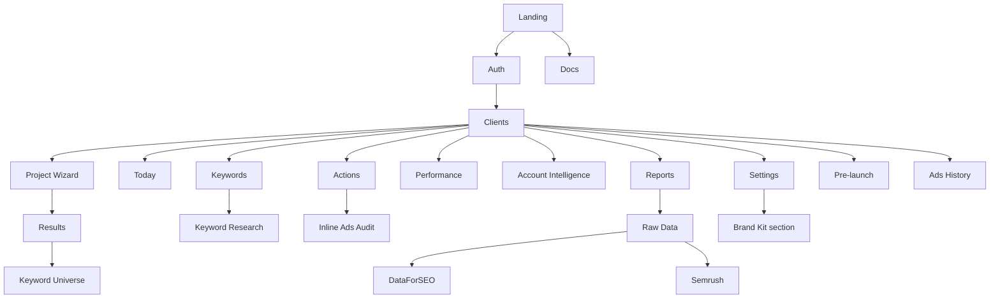
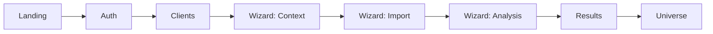
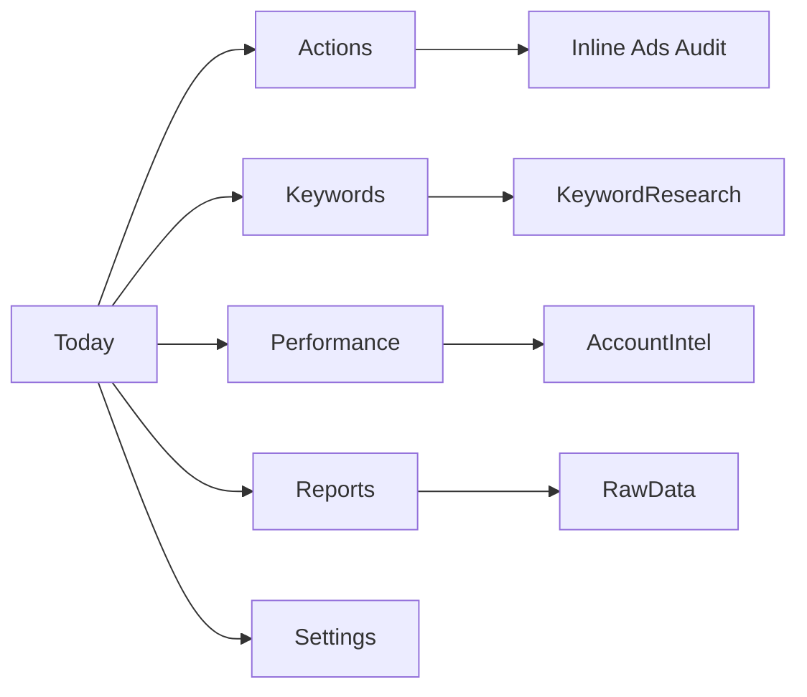
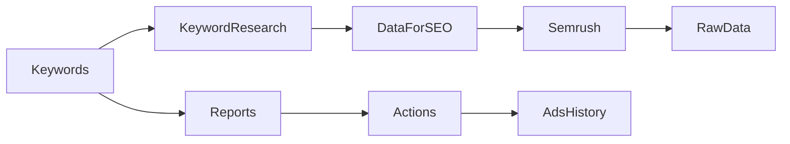

# Screen Inventory & Product Map

This document maps the current product surface, the main user flows, and the screenshot set captured in `docs/screenshots/`.

The screenshots were captured in local screenshot mode with representative mock data so the protected workspace routes could render end to end.

## Product Map

## Screen Inventory

### Public Screens

| Screen | Route / Access | Purpose | Screenshot |
|---|---|---|---|
| Landing | `/` | Marketing entry point with product story and CTA to auth/docs. | [00-landing.png](screenshots/00-landing.png) |
| Docs | `/docs` | Knowledge base and product explanation. | [01-docs.png](screenshots/01-docs.png) |
| Auth | `/auth` | Login / sign-up entry. | [02-auth.png](screenshots/02-auth.png) |

### Workspace Entry + Onboarding

| Screen | Route / Access | Purpose | Screenshot |
|---|---|---|---|
| Clients | `/clients` | Agency dashboard and client list. | [03-clients.png](screenshots/03-clients.png) |
| Project Wizard - Context | `/project/:id` step 1 | Define company context, market and inputs. | [project-wizard-step-context.png](screenshots/project-wizard-step-context.png) |
| Project Wizard - Import | `/project/:id` step 2 | Import customer data or SNI codes. | [project-wizard-step-import.png](screenshots/project-wizard-step-import.png) |
| Project Wizard - Analysis | `/project/:id` step 3 | Choose analysis modules and universe scale. | [project-wizard-step-analysis.png](screenshots/project-wizard-step-analysis.png) |
| Results | `/project/:id/results` | Analysis output and export surface. | [05-results.png](screenshots/05-results.png) |
| Keyword Universe | `/project/:id/results/universe` | Universe deep-dive with keywords and opportunities. | [06-keyword-universe.png](screenshots/06-keyword-universe.png) |

### Core Workspace Screens

| Screen | Route / Access | Purpose | Screenshot |
|---|---|---|---|
| Today | `/clients/:id` | Daily priority view, top action, and data-quality alerts. | [07-today.png](screenshots/07-today.png) |
| Keywords | `/clients/:id/keywords` | Keyword hub for clusters, briefs, strategy, and export. | [08-keywords.png](screenshots/08-keywords.png) |
| Actions | `/clients/:id/actions` | Action pipeline and prioritized execution queue. | [09-actions-default.png](screenshots/09-actions-default.png) |
| Actions - Ads Audit | Inline sheet from Actions | Deep audit surface with health check and sub-tabs. | [actions-audit-audit.png](screenshots/actions-audit-audit.png) |
| Actions - Ads Plan | Inline sheet from Actions | Planning view for gaps, ad groups, and next steps. | [actions-audit-plan.png](screenshots/actions-audit-plan.png) |
| Performance | `/clients/:id/performance` | KPI tracking and cross-channel performance trends. | [10-performance.png](screenshots/10-performance.png) |
| Account Intelligence | `/clients/:id/account-intelligence` | Campaign structure, health, and change timeline. | [11-account-intelligence.png](screenshots/11-account-intelligence.png) |
| Reports | `/clients/:id/reports` | Exportable reports and artifact library. | [12-reports.png](screenshots/12-reports.png) |
| Raw Data | `/clients/:id/raw-data` | Source-level inspection across Ads, GA4, GSC, keyword data. | [13-raw-data.png](screenshots/13-raw-data.png) |
| DataForSEO | `/clients/:id/dataforseo` | Keyword metrics workbench. | [14-dataforseo.png](screenshots/14-dataforseo.png) |
| Semrush | `/clients/:id/semrush` | Competitor and visibility workbench. | [15-semrush.png](screenshots/15-semrush.png) |
| Keyword Research | `/clients/:id/keyword-research` | Focused research / scoring view. | [16-keyword-research.png](screenshots/16-keyword-research.png) |
| Settings | `/clients/:id/settings` | Customer config, goals, connections, automations, brand. | [17-settings.png](screenshots/17-settings.png) |
| Pre-launch | `/clients/:id/prelaunch` | Pre-launch blueprint and planning surface. | [18-prelaunch.png](screenshots/18-prelaunch.png) |
| Ads History | `/clients/:id/ads-history` | Change log and revert trail for Ads mutations. | [19-ads-history.png](screenshots/19-ads-history.png) |

### Embedded / Secondary Surfaces

| Screen | Where it lives | Purpose | Screenshot |
|---|---|---|---|
| Brand Kit | Settings page section | Brand voice, fonts, palette, and logo handling. | Included in [17-settings.png](screenshots/17-settings.png) |
| Command Bar | Workspace layout overlay | Fast navigation and contextual actions. | Triggered from the workspace header |
| Data source alerts | Workspace layout banner | Surface stale / disconnected sources. | Visible in the workspace screenshots |
| Google reauth banner | Workspace layout banner | Re-auth guidance for Google connections. | Visible when needed |

## User Flows

### 1. New Customer Onboarding

### 2. Daily Workspace Loop

### 3. Research and Execution Loop

## Screenshot Index

- Public: `00-landing.png`, `01-docs.png`, `02-auth.png`
- Workspace entry: `03-clients.png`
- Onboarding: `project-wizard-step-context.png`, `project-wizard-step-import.png`, `project-wizard-step-analysis.png`
- Output: `05-results.png`, `06-keyword-universe.png`
- Workspace core: `07-today.png`, `08-keywords.png`, `09-actions-default.png`, `10-performance.png`, `11-account-intelligence.png`, `12-reports.png`
- Data workbenches: `13-raw-data.png`, `14-dataforseo.png`, `15-semrush.png`, `16-keyword-research.png`
- Config and utility: `17-settings.png`, `18-prelaunch.png`, `19-ads-history.png`
- Inline audit states: `actions-audit-audit.png`, `actions-audit-plan.png`

## Notes

- `ActionsPipeline` contains the Ads-audit and Ads-plan surfaces inline in a sheet, not as standalone routes.
- `BrandKit` is a subsection inside `Settings`, not a top-level route.
- The screenshot set is representative rather than data-live, because the real workspace uses Supabase RLS and auth gating.